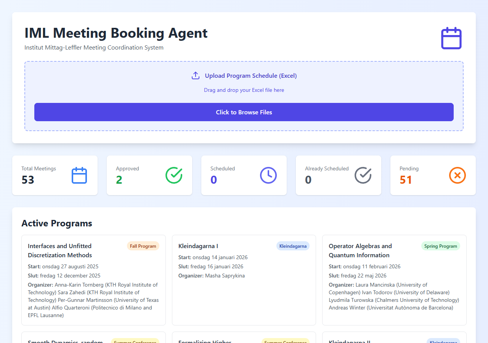
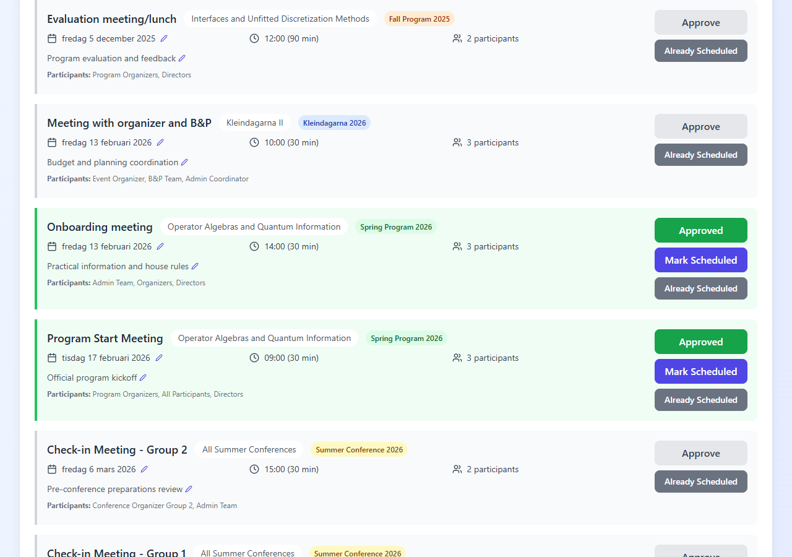

# IML Meeting Booking Agent - Admin User Manual

## Table of Contents

1. [Getting Started](#1-getting-started)
2. [Uploading Program Data](#2-uploading-program-data)
3. [Understanding Auto-Generated Meetings](#3-understanding-auto-generated-meetings)
4. [Managing Meetings](#4-managing-meetings)
5. [Conflict Detection & Resolution](#5-conflict-detection--resolution)
6. [Statistics Dashboard](#6-statistics-dashboard)
7. [Filtering Meetings](#7-filtering-meetings)
8. [Director Review Workflow](#8-director-review-workflow)
9. [Exporting Data](#9-exporting-data)
10. [Data Management](#10-data-management)
11. [Troubleshooting](#11-troubleshooting)

---

## 1. Getting Started

The IML Meeting Booking Agent is a web-based tool for coordinating meetings related to Institut Mittag-Leffler's research programs. It automatically generates meeting schedules from program data, allows you to manage and adjust meetings, and enables directors to review and approve them.

**Opening the application:**

1. Open your web browser and navigate to the application URL provided by your IT department.
2. The admin dashboard loads automatically as the home page.

The dashboard consists of:
- **Header** - Application title and branding
- **Upload Area** - Drag-and-drop zone for Excel files
- **Statistics Bar** - Quick overview of meeting counts by status
- **Conflict Warnings** - Alerts when meetings overlap (if any)
- **Action Buttons** - Tools for managing meetings and reviews
- **Meeting List** - All generated meetings grouped and sorted by date

---

## 2. Uploading Program Data

The system reads program schedules from Excel files (.xlsx or .xls) and automatically generates meetings based on the program types.

**How to upload:**

1. Prepare an Excel file with program data. The file should have columns for:
   - **Program** - The program name
   - **År** (Year) - The program year
   - **Datum** (Date) - Date range in Swedish format (e.g., "15 januari - 25 april")
   - **Organisatörer** (Organizers) - Program organizer names
   - **Bekräftad** (Confirmed) - "JA" if confirmed
2. Either **drag and drop** the Excel file onto the dashed upload area, or click **"Click to Browse Files"** to select it from your computer.
3. The system will parse the file, identify programs, and automatically generate meetings.
4. Only current and future programs are kept; past programs are filtered out.
5. Board meetings (styrelsemöte, prefektmöte) and similar non-program events are automatically excluded.

**Supported date formats:**
- Date ranges: "15 januari - 25 april"
- Day ranges in same month: "8-12 juni"
- Single dates: "15 januari"

---

## 3. Understanding Auto-Generated Meetings

When program data is uploaded, the system automatically creates meetings based on the program type. Each program type has a predefined set of meeting types.

### Spring Program & Fall Program

| Meeting | When | Duration | Participants |
|---------|------|----------|-------------|
| Introduction Meeting | ~18 months before start (Friday, 10:00) | 30 min | Organizers, Directors, Admin |
| Check-in with organizers | ~6 months before (Friday, 10:00) | 30 min | Organizers, Admin, Directors |
| Check-in junior fellows | ~6 months before (Friday, 10:30) | 30 min | Junior Fellows, Admin, Directors |
| Onboarding meeting | Friday before program start | 30 min | Admin, Organizers, Directors |
| Program Start Meeting | Program start day | 30 min | Organizers, All Participants, Directors |
| Mid-term meeting | ~6 weeks in (Friday) | 30 min | Organizers, Admin, Directors |
| Evaluation meeting/lunch | Last Friday before end (12:00) | 90 min | Organizers, Directors |

### Summer Conference

| Meeting | When | Duration |
|---------|------|----------|
| Introduction Meeting - Group 1 | ~8 months before (Friday, 10:00) | 30 min |
| Introduction Meeting - Group 2 | ~8 months before (Friday, 15:00) | 30 min |
| Check-in Meeting - Group 1 | ~3 months before (Friday, 10:00) | 30 min |
| Check-in Meeting - Group 2 | ~3 months before (Friday, 15:00) | 30 min |
| Weekly Onboarding (recurring) | Mondays during conference (09:30) | 30 min |
| Weekly Welcome (recurring) | Mondays during conference (10:00) | 15 min |

### Kleindagarna

| Meeting | When | Duration |
|---------|------|----------|
| Meeting with organizer and B&P | ~4 months before (Friday) | 30 min |
| Check-in meeting with Organizer | ~45 days before (Friday) | 30 min |

---

## 4. Managing Meetings

Each meeting is displayed as a card in the meeting list. You can edit, approve, and manage individual meetings.

### Editing Dates and Times

1. Find the meeting you want to edit in the meeting list.
2. Click the **date picker** (calendar input) next to the meeting date to select a new date.
3. Click the **time picker** to change the meeting time.
4. Changes are saved automatically and synced to any active director review.

### Editing Descriptions

1. Click the **pencil icon** next to the meeting description.
2. Type the new description in the text area that appears.
3. Click the **green save button** to confirm, or the **gray X button** to cancel.

### Approving/Unapproving Meetings

1. Click the **"Approve"** button on a meeting card to mark it as approved (turns green).
2. Click again to unapprove and return it to pending status.
3. Use **"Approve All"** to approve all meetings at once.

### Marking as Already Scheduled

1. Click **"Already Scheduled"** on meetings that have already been booked in the calendar.
2. These meetings will be excluded from director reviews and exports.
3. Click again to toggle back to pending.

### Understanding Status Indicators

| Status | Color | Meaning |
|--------|-------|---------|
| **Pending** | Gray | Not yet reviewed or approved |
| **Approved** | Green | Approved by admin, ready for scheduling |
| **Scheduled** | Indigo/Blue | Marked as scheduled |
| **Already Scheduled** | Gray (strikethrough) | Already in the calendar, excluded from reviews |
| **Conflict** | Red border with pulse | Overlaps with another meeting |

---

## 5. Conflict Detection & Resolution

When two or more meetings are scheduled at the same date and time, the system displays a conflict warning.

The conflict section appears as a red-bordered panel showing:
- The date and time of the conflict
- All meetings that overlap at that time slot
- Each meeting's program name and participants

### Resolving Conflicts

**Automatic resolution:**
1. Click the **"Auto-Resolve All Conflicts"** button (red button at the top of the conflict section).
2. The system will automatically move conflicting meetings to available times:
   - Director meetings are moved to Fridays
   - Other meetings keep the same day when possible
   - Times are adjusted to avoid overlaps

**Manual resolution:**
1. Find the conflicting meetings in the meeting list.
2. Use the date and time pickers to manually adjust one or both meetings.
3. The conflict warning will disappear once there are no more overlaps.

---

## 6. Statistics Dashboard

The statistics bar provides a real-time overview of all meetings.

| Counter | Meaning |
|---------|---------|
| **Total Meetings** | Total number of generated meetings |
| **Approved** | Meetings marked as approved by admin |
| **Scheduled** | Meetings marked as scheduled |
| **Already Scheduled** | Meetings already in the calendar (excluded from reviews) |
| **Pending** | Meetings not yet reviewed - these need attention |

---

## 7. Filtering Meetings

You can filter the meeting list by program type to focus on specific programs.

**How to filter:**

1. Locate the filter checkboxes in the action bar area (below the statistics).
2. Toggle the checkboxes for each program type:
   - **Spring Program** - Spring semester programs
   - **Fall Program** - Fall semester programs
   - **Kleindagarna** - Kleindagarna events
   - **Summer Conference** - Summer conferences
3. Only meetings matching the selected program types will be displayed.
4. All filters are enabled by default.

---

## 8. Director Review Workflow

The director review system allows Tobias Ekholm (Director) and Hans Ringström (Deputy Director) to review and approve meetings via a shared link.

### Creating a Shareable Review Link

1. Click the **"Share for Director Review"** button in the action bar.
2. A modal will appear with the review URL.
3. Click the **copy button** to copy the link to your clipboard.
4. Send this link to the directors via email or message.

### Syncing Meeting Changes

When you edit meeting dates or times after sharing a review:
- Changes are **automatically synced** to the director review view.
- Directors will see the updated information when they refresh their page (auto-refreshes every 5 seconds on their end).

### Monitoring Director Approvals

1. The system **auto-refreshes** director responses every 30 seconds.
2. On each meeting card, you can see:
   - How many directors have approved (green count)
   - How many have declined (red count)
   - Individual director responses and comments
3. Click **"Reload from Database"** to manually fetch the latest approvals.

### Clearing Director Reviews

1. Click to open the **clear reviews modal**.
2. Select which director's responses to clear, or clear all.
3. This is useful when meetings have been significantly changed and you need fresh responses.

### Removing Duplicates

1. Click **"Remove My Duplicates"** to clean up any duplicate meetings.
2. This removes duplicates from both the admin view and the active director review.

---

## 9. Exporting Data

### Export to Excel

1. Click **"Export to Excel"** in the action bar.
2. A .xlsx file will be downloaded containing all approved meetings with:
   - Subject (meeting type)
   - Date and time
   - Duration
   - Location
   - Attendees/participants
3. Use this for reporting or sharing with other staff.

### Export to Outlook (.ics)

1. Click **"Export to Outlook (.ics)"** in the action bar.
2. An .ics calendar file will be downloaded.
3. To import into Outlook:
   - Open Outlook
   - Go to **File > Open & Export > Import/Export**
   - Select **"Import an iCalendar (.ics) file"**
   - Browse to the downloaded file and click Open
4. All meetings will be added as tentative calendar entries.

---

## 10. Data Management

### Reload from Database

- Click **"Reload from Database"** to fetch the latest data from the server.
- Useful if you suspect the display is out of sync with the backend.

### Clean Corrupted Meetings

- Click **"Clean Corrupted Meetings"** to remove any meetings with invalid or placeholder names.
- This helps maintain data quality after imports or edits.

### Remove Duplicates

- Click **"Remove My Duplicates"** to identify and remove duplicate meeting entries.
- Duplicates can occur when uploading the same Excel file multiple times.

---

## 11. Troubleshooting

### Common Issues

| Problem | Solution |
|---------|----------|
| **Excel upload fails** | Ensure the file is .xlsx or .xls format. Check that column headers match expected names (Program, År, Datum, Organisatörer, Bekräftad). |
| **No meetings generated** | Verify the Excel file contains valid dates and program names. Check the browser console (F12) for parsing errors. |
| **Meetings show wrong dates** | Check the date format in your Excel file. Swedish format (e.g., "15 januari") is expected. |
| **Director review link not working** | Ensure the backend server is running. The review may have expired if the server was restarted. |
| **Approvals not showing** | Click "Reload from Database" to force refresh. Check that the backend is accessible. |
| **Conflicts not resolving** | Try manually adjusting dates/times if auto-resolve doesn't produce satisfactory results. |
| **Page shows old data** | Clear browser cache or use Ctrl+Shift+R to hard refresh the page. |
| **Export to Excel is empty** | Ensure at least some meetings are marked as approved before exporting. |

### Tips

- Always upload the latest version of the program schedule Excel file.
- Resolve conflicts before sharing the review with directors.
- Approve meetings only after directors have reviewed and responded.
- Use "Already Scheduled" for meetings that are confirmed in the calendar to keep them out of the review process.
- The system auto-saves to the backend whenever meetings or programs change.
