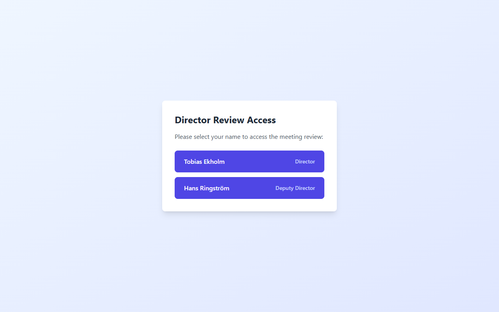
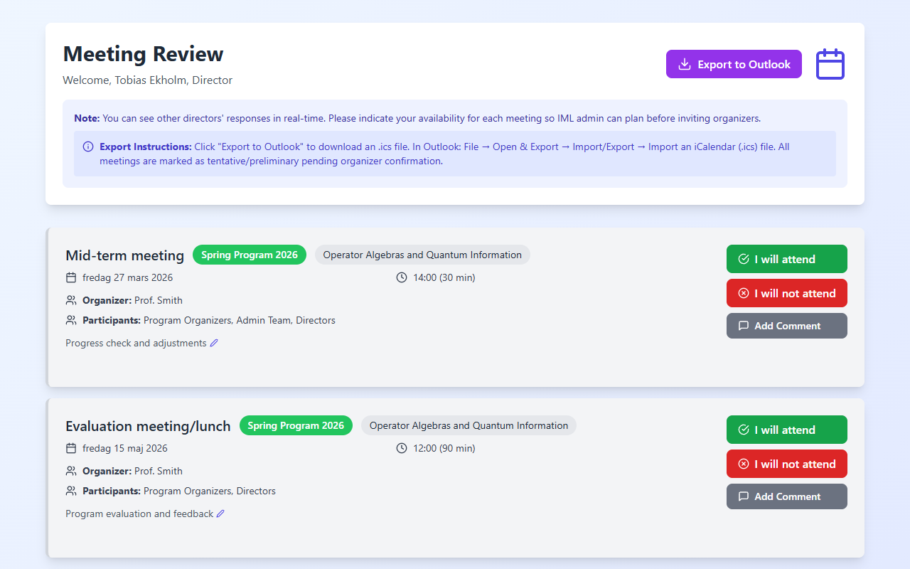
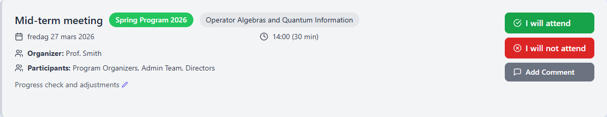
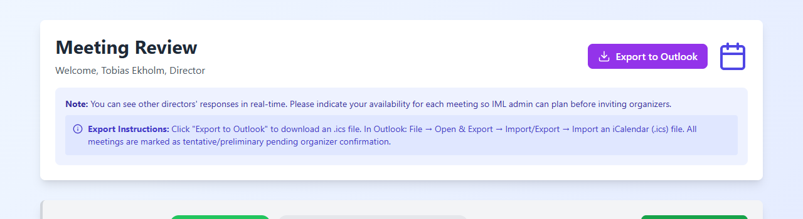

# IML Meeting Review - Director Quick Reference

This guide covers how to review and approve meetings using the IML Meeting Booking system.

---

## Accessing the Review

You will receive a review link from the IML admin. When you open it:

- Select your name from the two options: **Tobias Ekholm** (Director) or **Hans Ringström** (Deputy Director)
- Your selection determines whose approvals are tracked

---

## Reviewing Meetings

After selecting your name, you will see a list of meetings sorted by date.

Each meeting card shows:
- **Meeting type** and **program name** with a color-coded program type badge
- **Date and time** with duration in minutes
- **Organizer** and **participants** list
- **Description** of the meeting purpose

> Kleindagarna events, Summer Conference onboarding/welcome meetings, and already-scheduled meetings are automatically hidden.

---

## Approving or Declining Meetings

This is the core action. For each meeting, choose one of three options:

- **"I will attend"** (green) - You are available and will attend
- **"I will not attend"** (red) - You are not available
- **"Add Comment"** (gray) - Add a note without changing your attendance status

**To change your decision:**
- Click **"Change decision"** below your current response
- Select a new option, or click **"Clear My Response"** to start over

---

## Seeing the Other Director's Decisions

- When the other director responds, a **blue info box** appears on each meeting card showing their decision
- Responses update **automatically every 5 seconds** - no need to refresh the page
- You can see whether the other director is attending, not available, or has added comments

---

## Exporting to Outlook

- Click the purple **"Export to Outlook"** button in the top-right corner
- A `.ics` calendar file will download
- To import in Outlook: **File > Open & Export > Import/Export > Import an iCalendar (.ics) file**
- All meetings are marked as **tentative/preliminary** pending organizer confirmation

---

## Editing Descriptions

- Click the small **pencil icon** next to any meeting description to edit it
- Type your changes, then click the **green save button** to confirm or **X** to cancel
- Edits are visible to all users including the admin
